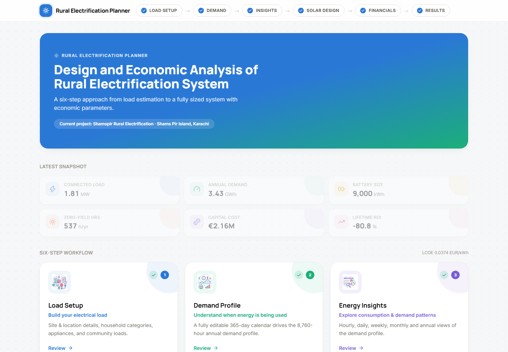
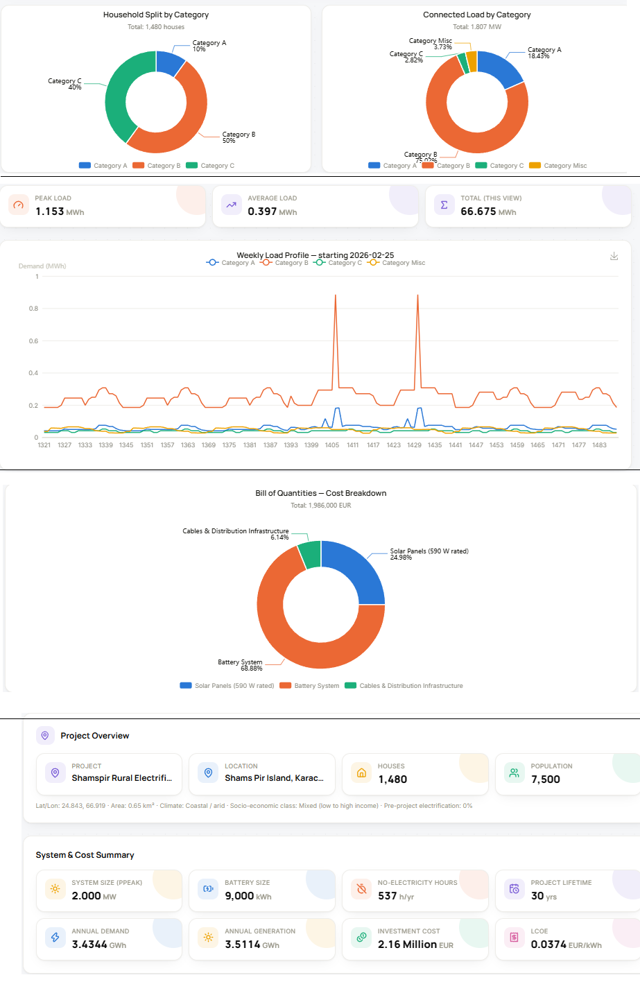
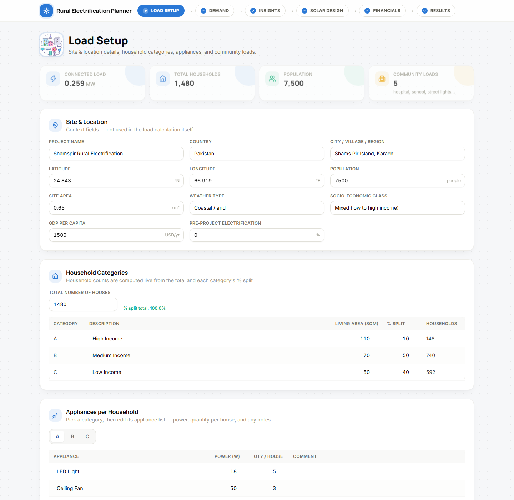
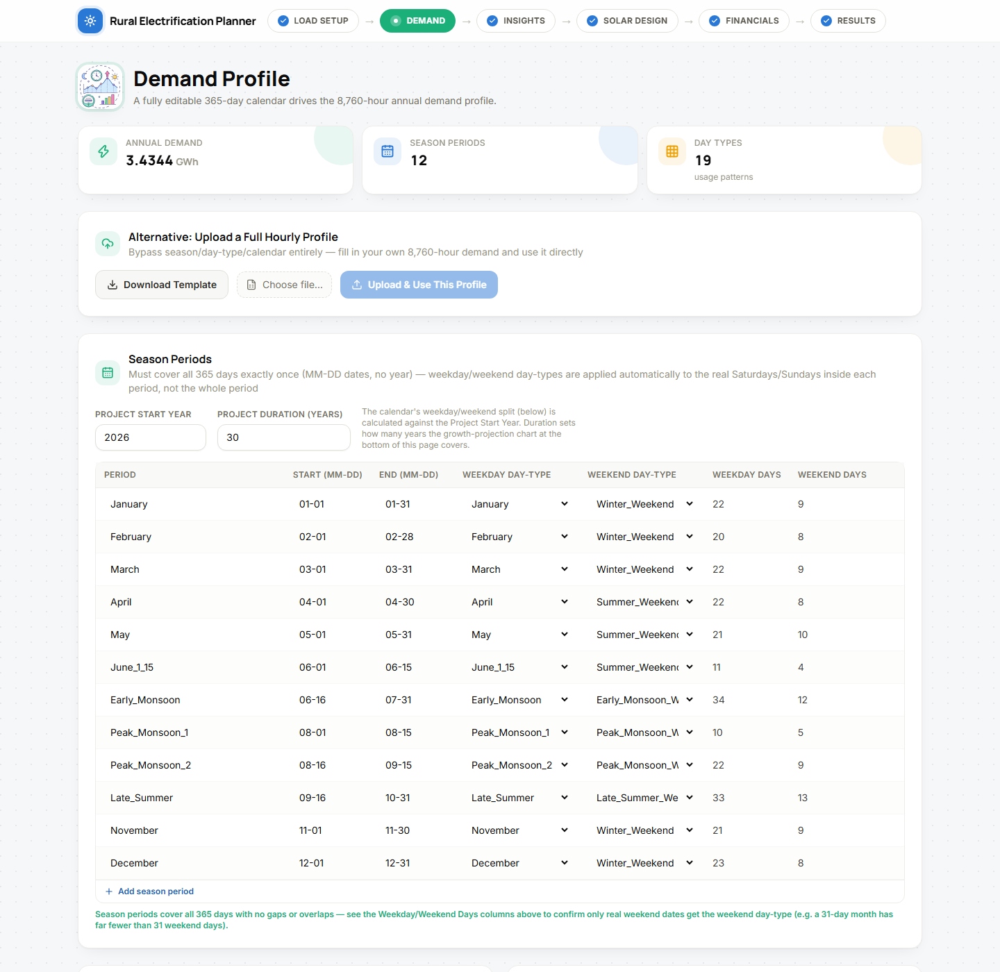
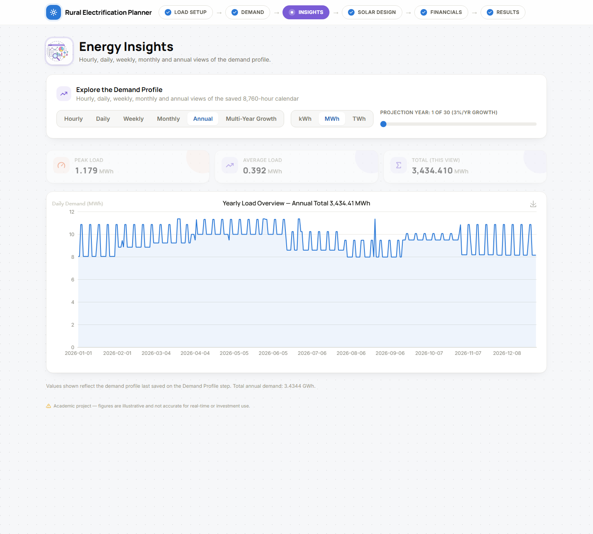
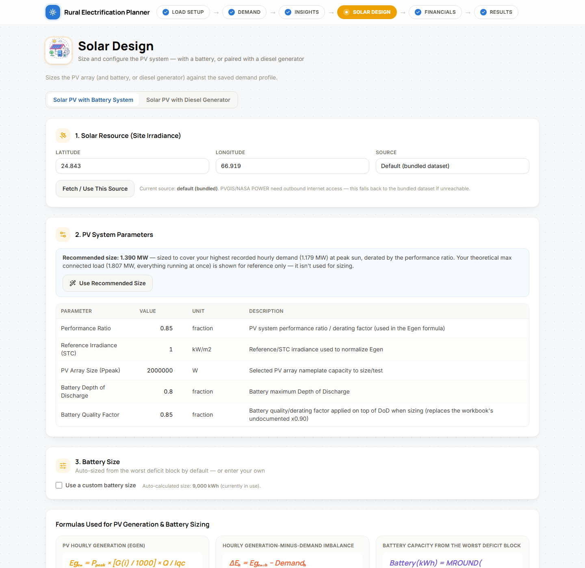
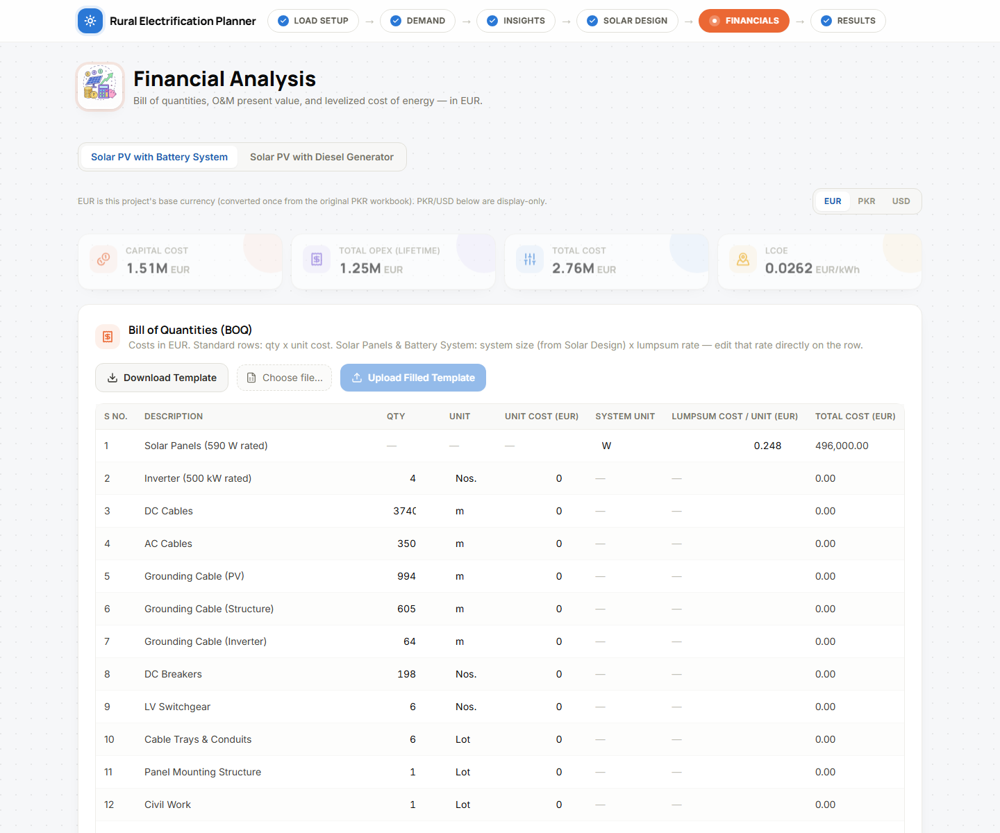
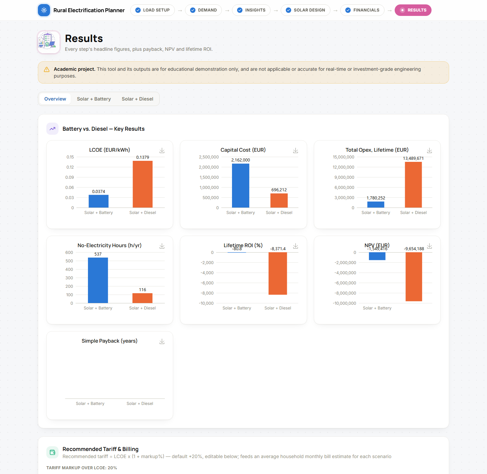

# Decentralized Electrification Planner

**Design and Economic Analysis of a Decentralized Electrification System focused for rural areas,  a six-step approach from load estimation to a fully sized off-grid electric system (for now only Solar PV with battery or diesel-generator backup) and all major economic parameters.**

> ⚠️ **Academic project.** This tool and its outputs are for educational demonstration only. Figures
> are illustrative and are **not** validated or accurate for real-time or investment-grade engineering
> or financial decisions.




---

## Table of Contents

- [Description & Scope](#description--scope)
- [Methodology](#methodology)
- [Repository Layout](#repository-layout)
- [Notebook Details](#notebook-details)
- [Workflow](#workflow)
- [Screenshots](#screenshots)
- [Setup](#setup)
- [Disclaimer](#disclaimer)

---

## Description & Scope

This project plans and economically evaluates a solar mini-grid for an off-grid rural community. It
starts from a household-by-household appliance inventory and ends at a fully sized PV plant, paired
with either a battery bank or a diesel generator, along with an LCOE calculation and an ROI/NPV/payback
cash-flow model.

It began as a Python re-implementation of an Excel-based engineering workbook
(`Base-Calculations-00.xlsx`) built for a reference site. By default, the Shamspir Island data from
that workbook is loaded into the app, and every value in it is fully editable. Each core calculation
was first built and validated in a series of Jupyter notebooks (see [Notebook Details](#notebook-details)),
then ported into a Streamlit-based dashboard, and finally rebuilt as the current app: a FastAPI backend
wrapping the same calculation modules as a JSON REST API, and a React + Tailwind CSS + Apache ECharts
frontend.

**Scope: Phase 1, Solar PV.** Two generation/storage pairings are supported side by side:

- **Solar PV + Battery**: PV sized from the load profile, battery sized from the worst deficit block.
- **Solar PV + Diesel Generator**: PV sized from average daytime demand, generator sized from the
  residual (unmet) load.

Wind, hydro, and biomass generation are out of scope for this phase.

## Methodology

The app follows six computational stages, based on the source workbook's own methodology. This is the
one place formulas are explained in detail; the other sections below describe what each part of the
app does, not how the math works.

**1. Connected load.** Total connected load is the sum of every appliance's rated power across all
households and community loads:

```
Connected Load = Σ (Appliance Power × Qty per House × Household Count)
```

Household counts are derived live from a total and each category's percentage split.

**2. Annual demand profile.** A fully editable calendar (season periods, public holidays, festival
holidays) assigns one of 19 day-type hourly usage patterns to every day of the year, producing an
8,760-hour demand profile:

```
Demand(hour) = Σ (Qty Active × Power × Household Count)
```

A custom hourly profile can also be uploaded directly, bypassing the calendar entirely.

**3. Solar resource & sizing.** Hourly PV generation:

```
Egen (Wh) = Ppeak (W) × [ G(i) / 1000 ] × Q / Iqc
```

where `G(i)` is hourly global irradiance (from a bundled dataset or a live PVGIS/NASA POWER pull), `Q`
is the system performance ratio, and `Iqc` is the reference irradiance.

For the battery pairing, the hourly surplus or deficit is:

```
ΔE(h) = Egen(h) − Demand(h)
```

Battery size is derived from the worst deficit block, divided by the depth of discharge and a battery
quality factor, then rounded. A manual override is always available.

For the diesel pairing, PV is sized off average daytime demand instead (there is no battery to smooth
output), and the generator is sized from the peak residual load with a safety margin, rounded up to a
practical unit size.

**4. Cost & LCOE.** The Bill of Quantities is editable: standard line items use quantity × unit cost,
while PV panels, the battery system, and diesel generators use system size × a lumpsum rate, so their
cost tracks the sizing from Step 3 automatically. O&M is discounted to present value over the project
lifetime, and:

```
LCOE = Total Cost (Capex + PV of Opex) / Total PV Generation
```

**5. Load growth.** Demand is projected across the project lifetime using a compound annual growth rate:

```
Energy(year n) = Energy(year 1) × (1 + g) ^ (n - 1)
```

The rate depends on population growth, income growth, connection-rate uptake, and productive-use
adoption (typical mini-grid range: 3 to 8% per year).

**6. Summary, ROI & payback.** All prior steps are combined into one summary, plus a year-by-year
cash-flow model (simple and discounted payback, NPV, lifetime ROI). This model doesn't exist in the
source workbook, which only computes cost, not revenue, so the electricity tariff used for revenue is
an explicit placeholder (break-even = LCOE) rather than a researched market rate.

Full formula-by-formula detail on the source workbook is in
[`docs/Workbook-Methodology-Reference.md`](docs/Workbook-Methodology-Reference.md). Build decisions and
their rationale are logged in [`docs/PROJECT_LOG.md`](docs/PROJECT_LOG.md).

## Repository Layout

```
decentralized-electrification-planner/
├── notebooks/                          # Development notebooks, one per core stage
├── data/                               # Default assumption tables and saved results (editable CSV)
├── rural-electrification-webapp/       # The app: current, actively developed deliverable
│   ├── backend/                        #   FastAPI REST API
│   │   ├── api.py                      #     All HTTP endpoints
│   │   ├── core/                       #     Calculation modules, ported from the notebooks
│   │   └── main.py                     #     FastAPI app entrypoint
│   └── frontend/                       #   React + Vite + Tailwind CSS + Apache ECharts SPA
│       └── src/
│           ├── pages/                  #     One page per workflow step
│           ├── components/             #     Shared UI (charts, tables, KPI cards)
│           └── lib/                    #     Chart builders and shared client logic
├── app/                                # Legacy Streamlit app, kept for reference only
├── docs/
│   ├── Workbook-Methodology-Reference.md   # Full formula reference for the source workbook
│   ├── PROJECT_LOG.md                      # Scope decisions and build history
│   ├── Local-VSCode-Setup.md               # Editor/venv setup notes
│   └── screenshots/                        # README screenshots
├── Base-Calculations-00.xlsx            # Original source workbook (reference only)
└── requirements.txt                     # Python dependencies
```

## Notebook Details

Each notebook was built and validated against the source workbook before its logic was ported into
`backend/core/`. Running them isn't required to use the app, since the app already ships with the
extracted default data in `data/`.

| # | Notebook | What it does |
|---|---|---|
| 1 | `01_Connected_Load_Estimation.ipynb` | Builds the household, appliance, and misc-load tables, and computes total connected load. |
| 2 | `02_Hourly_Load_Profile.ipynb` | Extracts the 19 day-type hourly usage patterns and builds the 8,760-hour annual demand profile from an editable season/holiday calendar. |
| 3 | `03_Load_Profile_Visualization.ipynb` | Builds the weekly, monthly, and yearly chart views over the demand profile, switchable between kWh, MWh, and TWh. |
| 4 | `04_Solar_Resource_and_PV_Battery_Sizing.ipynb` | Sources hourly irradiance, computes hourly PV generation, and sizes the battery from the demand/generation deficit. |
| 5 | `05_Cost_BOQ_LCOE.ipynb` | Builds the itemized Bill of Quantities, O&M present value, and LCOE. |
| 6 | `06_Summary_Table.ipynb` | Combines every prior step into one summary and builds the ROI/payback/NPV cash-flow model. |

## Workflow

The app guides you through six steps, shown as a stepper across the top of every page.

1. **Load Setup.** Site and location context, household categories, per-category appliance lists, and
   community loads.
2. **Demand Profile.** The editable season/holiday/day-type calendar that generates the annual demand
   profile (or upload your own hourly profile directly). Also sets the project's start year, duration,
   and annual load-growth rate.
3. **Energy Insights.** Explore the demand profile at hourly, daily, weekly, monthly, or annual
   granularity, plus a multi-year view.
4. **Solar Design.** Two sub-tabs, Solar + Battery and Solar + Diesel Generator: irradiance source, PV
   sizing, and battery or generator sizing.
5. **Financials.** Mirrored Battery and Diesel tabs with an editable Bill of Quantities (Excel
   upload/download supported), cost parameters, and the resulting capital cost, opex, and LCOE.
6. **Results.** An Overview tab comparing both scenarios side by side, plus full Battery and Diesel
   results tabs with ROI assumptions, a payback/NPV chart, the annual cash-flow table, and a full
   project Excel export.

## Screenshots

| | |
|---|---|
| **Load Setup** | **Demand Profile** |
|  |  |
| **Energy Insights** | **Solar Design** |
|  |  |
| **Financials** | **Results** |
|  |  |

## Setup

### 1. Prerequisites

- Python 3.10+
- Node.js (for the frontend; install from [nodejs.org](https://nodejs.org) if `npm` isn't recognized)
- Git

### 2. Download the project

```bash
git clone https://github.com/hamza-anzar/decentralized-electrification-planner.git
cd decentralized-electrification-planner
```

### 3. Python environment (backend + notebooks)

From the project root:

```bash
python -m venv venv
venv\Scripts\activate        # Windows. Use `source venv/bin/activate` on macOS/Linux
pip install -r requirements.txt
```

### 4. (Optional) Re-run the development notebooks

Not required to run the app, since it already ships with the extracted default data in `data/`. Run
these only if you want to see or reproduce how each calculation was originally derived and validated:

```bash
jupyter notebook notebooks/
```

Open and run, in order: `01_Connected_Load_Estimation.ipynb`, `02_Hourly_Load_Profile.ipynb`,
`03_Load_Profile_Visualization.ipynb`, `04_Solar_Resource_and_PV_Battery_Sizing.ipynb`,
`05_Cost_BOQ_LCOE.ipynb`, `06_Summary_Table.ipynb`.

### 5. Frontend dependencies

```bash
cd rural-electrification-webapp/frontend
npm install
cd ../..
```

(`node_modules/` is never committed. Always run `npm install` after cloning or pulling frontend changes.)

### 6. Run the dashboard

The app runs as two processes at once, so use two terminals.

**Terminal 1 (backend)**, from the project root:

```bash
venv\Scripts\activate
cd rural-electrification-webapp/backend
uvicorn main:app --reload --port 8000
```

**Terminal 2 (frontend):**

```bash
cd rural-electrification-webapp/frontend
npm run dev
```

Then open the URL Vite prints, usually **http://localhost:5173**. The frontend talks to the backend at
`http://localhost:8000` by default. If you change that port, also set `VITE_API_URL` for the frontend
(see `rural-electrification-webapp/frontend/README.md` if present).

### Legacy Streamlit app (reference only)

`app/Home.py` still runs (`streamlit run app/Home.py`) but is no longer developed. The FastAPI + React
app above is the actively maintained deliverable.

## Disclaimer

**Academic project.** This tool and its outputs are for educational demonstration only. Formulas,
default assumptions, and results are not validated or accurate for real-time or investment-grade
engineering or financial decisions. Do not use this project's outputs as the basis for an actual
electrification investment, procurement, or engineering design without independent professional
verification.
